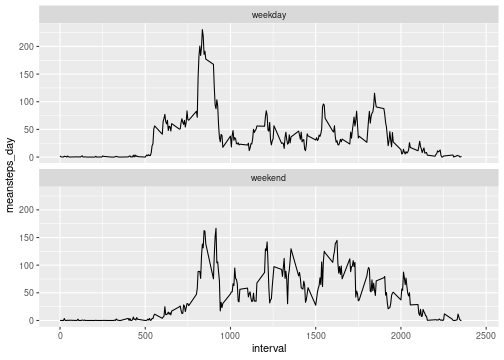

## Load the data

The data is read in and no initial formatting was performed.  Two packages were loaded to help with processing this data.  The tidyverse was used as much as possible for this report instead of base R commands.


```r
library(tidyverse)
```

```
## ── Attaching packages ─────────────────────────────────────────────────────────────────────── tidyverse 1.3.0 ──
```

```
## ✓ ggplot2 3.3.1     ✓ purrr   0.3.4
## ✓ tibble  3.0.1     ✓ dplyr   1.0.0
## ✓ tidyr   1.1.0     ✓ stringr 1.4.0
## ✓ readr   1.3.1     ✓ forcats 0.5.0
```

```
## ── Conflicts ────────────────────────────────────────────────────────────────────────── tidyverse_conflicts() ──
## x dplyr::filter() masks stats::filter()
## x dplyr::lag()    masks stats::lag()
```

```r
library(lubridate)
```

```
## 
## Attaching package: 'lubridate'
```

```
## The following objects are masked from 'package:base':
## 
##     date, intersect, setdiff, union
```

```r
data <- read_csv("activity.csv")
```

```
## Parsed with column specification:
## cols(
##   steps = col_double(),
##   date = col_date(format = ""),
##   interval = col_double()
## )
```

## What are the total number, mean number, and median number of steps taken per day?

### Total number of steps per day

The tibble below contains the total number of steps taken for each day. 


```r
steps_day <- data %>%
  drop_na() %>% 
  group_by(date) %>%
  summarize(totalsteps_day = sum(steps), .groups = "drop")

steps_day
```

```
## # A tibble: 53 x 2
##    date       totalsteps_day
##    <date>              <dbl>
##  1 2012-10-02            126
##  2 2012-10-03          11352
##  3 2012-10-04          12116
##  4 2012-10-05          13294
##  5 2012-10-06          15420
##  6 2012-10-07          11015
##  7 2012-10-09          12811
##  8 2012-10-10           9900
##  9 2012-10-11          10304
## 10 2012-10-12          17382
## # … with 43 more rows
```


### Histogram

The histogram below provides a graphical representation of the total number of steps taken for each day.  


```r
steps_day %>% 
    ggplot(., aes(x = totalsteps_day)) +
    geom_histogram(binwidth = 1000)
```


### Mean and median for total steps per day


```r
mean_steps <- steps_day %>% 
  summarize(meansteps_day = mean(totalsteps_day), .groups = "drop") %>% 
  pull(meansteps_day)

median_steps <- steps_day %>% 
  summarize(mediansteps_day = median(totalsteps_day), .groups = "drop") %>% 
  pull(mediansteps_day)
```

The mean for the total number of steps taken per day was **10766.1886792** and the median was **10765**.


## Average daily activity pattern

The time-series plot was developed from the original data file.  All missing values were dropped and means for steps per day were calculated for each interval.    


```r
time_series_plot <- data %>%
  drop_na() %>% 
  group_by(interval) %>% 
  summarize(meansteps_day = mean(steps), .groups = "drop") %>% 
  ggplot(., aes(x=interval, y=meansteps_day)) +
  geom_line() +
  scale_x_continuous(limits = c(0, 2450))

time_series_plot
```


```r
maxinterval <- data %>%
  drop_na() %>% 
  group_by(interval) %>% 
  summarize(meansteps_day = mean(steps), .groups = "drop") %>% 
  filter(meansteps_day == max(meansteps_day)) %>% 
  pull(interval)
```


On average across all the days in the dataset, the time interval of **835** contains the maximum number of steps.  This corresponds to the approximate location on the time-series plot where the peak occurs as shown above.


## Impute missing values


```r
missing_values <- data %>% 
  summarise(missing = sum(is.na(steps))) %>% 
  mutate(missing = as.double(missing)) %>% 
  pull(missing)

meaninterval <- data %>%
  drop_na() %>% 
  group_by(interval) %>% 
  summarize(meansteps_day = mean(steps), .groups = "drop")

data_nomis <- data %>% 
  inner_join(meaninterval, by = "interval") %>% 
  mutate(steps = if_else(is.na(steps), meansteps_day, steps)) %>% 
  select(-meansteps_day)
```

The total number of missing values in the dataset (i.e. the total number of rows with NAs) corresponded to **2304** rows.

The strategy used to replace the missing values in the dataset was to use the mean for the 5-minute intervals averaged over all the days, which was calculated previously.  This dataset was joined with the original dataset with an inner join, and the missing values were replaced with the corresponding 5-minute interval mean.  The meansteps_day column was deleted from the dataset.


### New histogram

Based on the histogram, counts have increased for some of the totalsteps_day when imputed missing values were included.  


```r
steps_day_nomis <- data_nomis %>%
  group_by(date) %>% 
  summarize(totalsteps_day = sum(steps), .groups = "drop")


steps_day_nomis %>% 
  ggplot(., aes(x = totalsteps_day)) +
    geom_histogram(binwidth = 1000)
```


### New mean and median with imputed values


```r
mean_steps_nomis <- steps_day_nomis %>% 
  summarize(meansteps_day = mean(totalsteps_day), .groups = "drop") %>% 
  pull(meansteps_day)

median_steps_nomis <- steps_day_nomis %>% 
  summarize(mediansteps_day = median(totalsteps_day), .groups = "drop") %>% 
  pull(mediansteps_day)
```

The new mean calculated with the imputed values was **10766.1886792** that was equivalent to the mean calculated previously by eliminating the missing values. The median calcuated with the imputed values was **10766.1886792**.  Although not exact, this median was essentially the same as the median calculated with the missing values removed from the dataset.  However, the imputed median is equal to the imputed mean.


## Weekdays vs. Weekends

The plot below indicates that activity between approximately 10 am and 8 pm (1000 to 2000) was greater on the weekend compared to weekdays.  However, based on a visual inspection, the period from approximately 8 am to 10 pm (800 to 1000) was greater for the weekdays compared to the weekend.

Note:  This plot is not showing up in the rendered document, but is listed in the figures folder.  I can't find any explanation as to why the plot is not showing up.  The figure shows up below the code chunk, but not in the final rendered document.


```r
days_classified <- data_nomis %>% 
  mutate(day_name = wday(date, label=TRUE)) %>% 
  mutate(type_of_day = if_else(day_name == "Sat" |
                                day_name == "Sun", "weekend", "weekday")) %>% 
  group_by(interval, type_of_day) %>% 
  summarize(meansteps_day = mean(steps), .groups = "drop") %>% 
  ggplot(., aes(x=interval, y=meansteps_day)) +
  geom_line() +
  facet_wrap(~type_of_day, nrow = 2) +
  scale_x_continuous(limits = c(0, 2450))

days_classified
```




